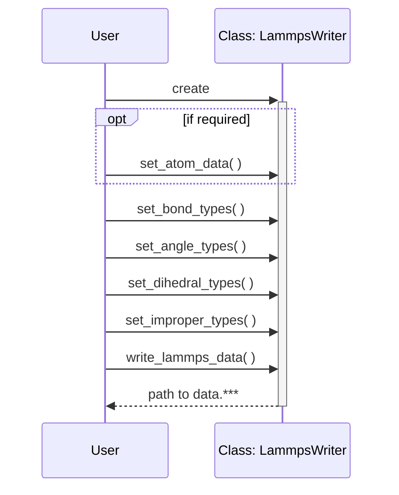

## Sequence



## Class

```puml
package ase {
  class Atoms
  package calculators.lammpsrun {
    class Prism
  }
}

class BondedAtoms {
  -_max_bonds
  {static} +inherit()
  +add_bond()
  +get_bonds()
  +remove_bond()
  +change_max_bonds()
  +get_bonds_per_atom()
  +get_bonded_bonds()
  +get_bonded_angles()
  +get_bonded_dihedrals()
  +get_bonded_impropers()
}

note left: Has ASE's functionalities

class ExtendedPrism {
  +transform_to_lammps()
}

class LammpsWriter {
  +get_required_datanames()
  +get_required_datanames_for_molecule()
  +get_sequence_patterns()
  +get_bond_patterns()
  +get_angle_patterns()
  +get_dihedral_patterns()
  +get_improper_patterns()
  +get_maximum_per_atom()
  +get_max_bonds_per_atom()
  +get_max_angles_per_atom()
  +get_max_dihedrals_per_atom()
  +get_max_impropers_per_atom()
  +set_atom_data()
  +set_atom_types()
  +set_masses()
  +set_topology_types()
  +set_bond_types()
  +set_angle_types()
  +set_dihedral_types()
  +set_improper_types()
  +write_lammps_data()
  +write_lammps_molecule()
  -LammpsAtoms :: lmp_atoms
  -LammpsBonds :: topo
  -LammpsAngles :: topo
  -LammpsDihedrals :: topo
  -LammpsImpropers :: topo
}

class LammpsAtoms {
  #get_num()
  #get_num_type()
  #get_required_datanames()
  #set_data()
  #write_lines()
  #write_lines_for_molecule()
}

class LammpsTopology {
  {static} #create()
  #get_num()
  #get_num_type()
  #get_sequence_patterns()
  #get_maximum_per_atom()
  #set_types()
  #write_lines()
  -lines
  -make_full_seq_to_type()
}

class LammpsBonds {
}

class LammpsAngles {
}

class LammpsDihedrals {
}

class LammpsImpropers {
  -make_full_seq_to_type()
}

class LammpsSpecialBonds {
  #write_lines()
}

class LammpsDataLines {
  #set_data()
  #write()
  -line_format
  -section_header
}

Atoms <|-- BondedAtoms
Prism <|-- ExtendedPrism

LammpsTopology <|-- LammpsBonds
LammpsTopology <|-- LammpsAngles
LammpsTopology <|-- LammpsDihedrals
LammpsTopology <|-- LammpsImpropers

LammpsWriter "1" o-- "1" LammpsAtoms
LammpsWriter "1" o-- "4" LammpsTopology
LammpsWriter "1" o-- "1" LammpsSpecialBonds
LammpsAtoms "1" o-- "2" LammpsDataLines
LammpsTopology "1" o-- "1" LammpsDataLines

BondedAtoms <.. LammpsWriter
ExtendedPrism <.. LammpsWriter
```
