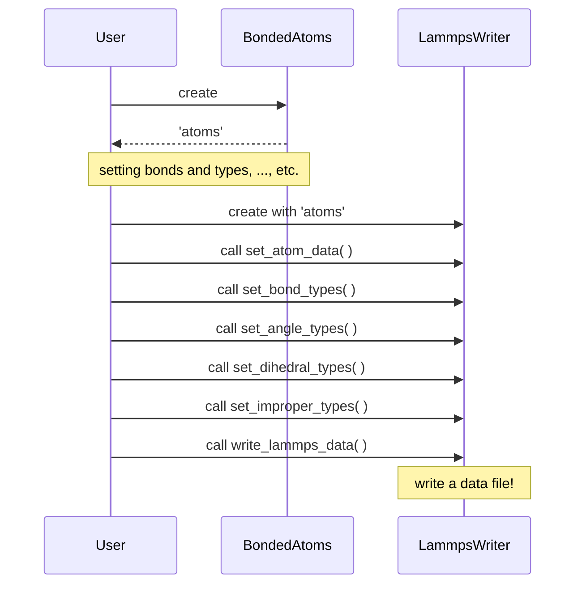

## Sequence



## Class

```puml
package ase {
  class Atoms
  package calculators.lammpsrun {
    class Prism
  }
}

class BondedAtoms {

}

note left: Has ASE's functionalities

class ExtendedPrism {

}

class LammpsWriter {

}

class LammpsAtoms {

}

class LammpsTopology {

}

class LammpsBonds {
}

class LammpsAngles {
}

class LammpsDihedrals {
}

class LammpsImpropers {

}

class LammpsSpecialBonds {

}

Atoms <|-- BondedAtoms
Prism <|-- ExtendedPrism

LammpsTopology <|-- LammpsBonds
LammpsTopology <|-- LammpsAngles
LammpsTopology <|-- LammpsDihedrals
LammpsTopology <|-- LammpsImpropers

LammpsWriter "1" o-- "1" LammpsAtoms
LammpsWriter "1" o-- "4" LammpsTopology
LammpsWriter "1" o-- "1" LammpsSpecialBonds

BondedAtoms <.. LammpsWriter
ExtendedPrism <.. LammpsWriter
```
